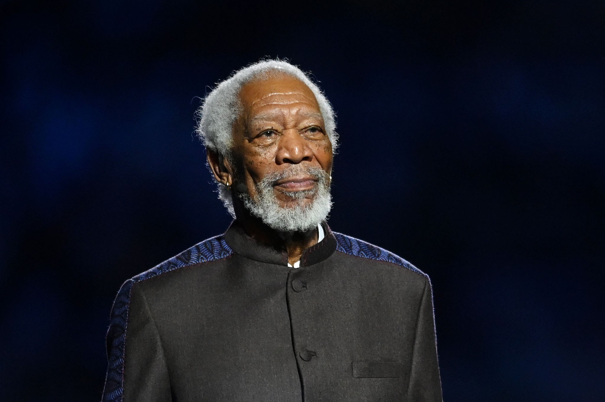
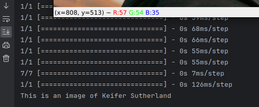

Back in late September, Cloudflare launched [Vectorize](https://blog.cloudflare.com/vectorize-vector-database-open-beta/), their serverless vector database, in beta.

### Concept

While commonly used for applications such as ecommerce (think storefront search and recommendations) and AI (think ChatGPT), vector databases can also be used for facial recognition. Machine learning can collect a unique vector, almost like a fingerprint, that identifies the unique landmarks of that face. By calculating the average distance between two vectors, we can determine how similar two faces are. This is how your phone does Face ID! (with a lot more security involved of course 😅)

I have a camera outside the front of my house - not in the city, so I'm not intruding on neighbours - and thought it would be cool to recognize whether the same people come and go (e.g. are they the same delivery drivers?). I could use a self-hosted vector database... but where's the fun in that?! Plus, Vectorize is serverless, meaning I don't need to pay for a VPS somewhere or manage things myself - right now it's all free, but in the future customers will be billed based on their exact usage.

### Preparation

Recognizing faces in a fast-moving scene is a lot of work, since real-time facial embeddings are difficult to do, so I wanted to get an early proof-of-concept working.

I thought about doing it entirely via Cloudflare Workers, and indeed might in the future if a facial recognition model is added to [Workers AI](https://blog.cloudflare.com/workers-ai/), but uploading a new frame 10 times per second is a lot of bandwidth. So instead I used the excellent [`deepface`](https://github.com/serengil/deepface) Python library running on my computer locally.

First I created the Vectorize database via Cloudflare's Wrangler CLI. I used the `cosine` metric for proper matching and a dimension of 512, because that's what `deepface`'s Facenet512 model returns (which I'm using).
```bash
npx wrangler vectorize create "faces" --metric cosine --dimensions 512
```

Then I took three well-lit images of famous actors (pictured: Tom Cruise, Keifer Sutherland, and Morgan Freeman). 




I extracted the embeddings of the training images via `deepface`, and then sent them to Vectorize with the Vectorize REST API's [Insert endpoint](https://developers.cloudflare.com/api/operations/vectorize-insert-vector). I made sure to put their names in the Vectors' metadata, which is returned when you query them. This allows me to match the name of the person with the vector.

```python
embeddings = DeepFace.represent(input_image, model_name="Facenet512", detection_backend="mtcnn")
headers = {
    "Content-Type": "application/x-ndjson",
    "X-Auth-Key": "<MY API KEY>",
    "X-Auth-Email": "<MY EMAIL>"
}
data = json.dumps({
    "id": "1",
    "metadata": {
        "name": "Tom Cruise"
    },
    "values": embeddings[0]['embedding']
})
response = requests.post(
    "https://api.cloudflare.com/client/v4/accounts/<MY ACCOUNT ID>/vectorize/faces/insert",
)
```

Make sure to replace the placeholders with your own values, and the `/faces/` section with whatever you named your Vectorize index.

Side note: make sure you are sending the vectors in proper `application/x-ndjson` format and are using a string as the ID, not a number (see the [docs](https://developers.cloudflare.com/vectorize/learning/insert-vectors/)). Otherwise your vector will be rejected.

### Testing

Next, I took an image of Keifer Sutherland from a movie that might be a bit harder than the training images to run recognition on - he's smaller in the frame and at an oblique angle.


I ran it through `deepface` and sent the resulting embedding to Vectorize via the [Query endpoint](https://developers.cloudflare.com/api/operations/vectorize-query-vector). I specified the `returnVectors` parameter so that the metadata was returned in the query response, and asked it to return the closest match via a `topK` parameter setting of 1.

```python
embeddings = DeepFace.represent(input_image, model_name="Facenet512", detection_backend="mtcnn")
headers = {
    "Content-Type": "application/json",
    "X-Auth-Key": "<MY API KEY>",
    "X-Auth-Email": "<MY EMAIL>"
}
body = json.dumps({
    "returnVectors": True,
    "topK": 1,
    "vector": embeddings[0]['embedding']
})
closest = requests.post(
    "https://api.cloudflare.com/client/v4/accounts/<MY ACCOUNT ID>/vectorize/faces/query",
    headers=headers,
    data=body
)
closest = closest.json()
# The closest match is the first result
closest = closests['result']['matches'][0]
# The name is in the metadata.
name = closest['vector']['metadata']['name']
print("This is an image of " + name)
```

And... voila! It correctly matched the face to the closest embedding, which was Keifer Sutherland.



### Next Steps

Obviously this is a very simple proof-of-concept, but it shows the power of Vectorize. Next I plan to experiment with different `deepface` backends - I'm using `mtcnn` and `Facenet512` here, which are very fast but nowhere near fast enough for real-time. Once I have a good model, I'll try running it on a live camera stream and eventually on my camera in front of my house.